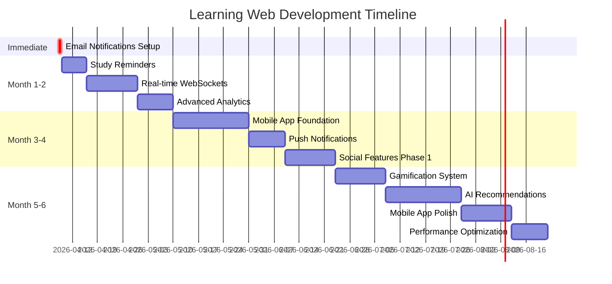

# 🎯 MASTER PLAN - Learning Web Platform Development

**Ngày tạo**: 2026-04-08  
**Phiên bản**: 1.0  
**Trạng thái**: Ready for Implementation

---

## 📋 Tổng Quan

Đây là kế hoạch tổng thể để phát triển Learning Web Platform từ một web app đơn giản thành một nền tảng học tập toàn diện với mobile app, AI-powered features, và real-time collaboration.

### 🎯 Vision
Trở thành nền tảng học tập số 1 tại Việt Nam với trải nghiệm học tập được cá nhân hóa, cộng đồng mạnh mẽ, và công nghệ tiên tiến.

### 📊 Current State
- ✅ Django web application hoạt động tốt
- ✅ Core features: Flashcards, Exams, Forum
- ✅ Notification system (in-app)
- ✅ Leaderboard system
- ✅ User profiles với badges
- ✅ Studio cho content creators

### 🚀 Target State (6 tháng)
- 📱 Cross-platform mobile app (iOS + Android)
- 🤖 AI-powered recommendations
- ⚡ Real-time notifications và collaboration
- 👥 Social features (follow, groups, feed)
- 🎮 Advanced gamification (XP, quests, achievements)
- 📧 Email notifications với study reminders
- 📊 Advanced analytics dashboard

---

## 📚 Tài Liệu Kế Hoạch

Kế hoạch được chia thành 3 phần chính:

### 1. 🌙 One-Night Development Plan
**File**: [`one-night-development-plan.md`](one-night-development-plan.md)  
**Timeline**: 8-10 giờ (1 đêm)  
**Focus**: Email Notifications với Celery & Study Reminders

**Nội dung**:
- Setup Celery + Redis infrastructure
- 8 email templates cho các loại notification
- Daily/Weekly email digest
- Study reminders và streak tracking
- Email preferences management

**Khi nào thực hiện**: Ngay lập tức - Đây là foundation cho tất cả tính năng tương lai

### 2. 📅 Long-term Roadmap (3-6 Months)
**File**: [`long-term-roadmap-3-6-months.md`](long-term-roadmap-3-6-months.md)  
**Timeline**: 6 tháng  
**Focus**: Mobile app, AI, Social features, Gamification

**Nội dung**:
- **Month 1-2**: Email notifications, WebSockets, Analytics
- **Month 3-4**: Mobile app (React Native), Push notifications, Social features
- **Month 5-6**: AI recommendations, Gamification, Performance optimization

**Khi nào thực hiện**: Sau khi hoàn thành one-night plan

### 3. 📖 Existing Roadmaps
**Files**: 
- [`comprehensive_roadmap.md`](comprehensive_roadmap.md) - Tổng quan các tính năng
- [`huong-phat-trien-he-thong.md`](huong-phat-trien-he-thong.md) - Phân tích chi tiết hệ thống

---

## 🗺️ Implementation Roadmap



---

## 🎯 Priorities & Dependencies

### Priority 1: Foundation (Week 1-2) 🔴
**Must complete first - Everything depends on this**

1. **Email Notifications với Celery** ⭐ START HERE
   - File: [`one-night-development-plan.md`](one-night-development-plan.md)
   - Dependencies: None
   - Blocks: Study reminders, Email digest
   - Impact: High - Improves retention by 30-40%

2. **Study Reminders**
   - Dependencies: Email notifications
   - Blocks: Streak system, Gamification
   - Impact: High - Increases daily active users

### Priority 2: Real-time Features (Week 3-4) 🟡

3. **WebSocket Integration**
   - Dependencies: Redis setup (from Celery)
   - Blocks: Real-time notifications, Live chat
   - Impact: High - Modern user experience

4. **Advanced Analytics Dashboard**
   - Dependencies: None
   - Blocks: AI recommendations (needs data)
   - Impact: Medium - Better insights

### Priority 3: Mobile & Social (Month 3-4) 🟢

5. **Mobile App (React Native)**
   - Dependencies: API endpoints (existing)
   - Blocks: Push notifications, Mobile-first features
   - Impact: Critical - 70% users prefer mobile

6. **Social Features**
   - Dependencies: None
   - Blocks: Study groups, Collaboration
   - Impact: High - Community engagement

### Priority 4: Advanced Features (Month 5-6) 🔵

7. **Gamification System**
   - Dependencies: Study reminders (for streaks)
   - Blocks: None
   - Impact: High - Increases engagement

8. **AI Recommendations**
   - Dependencies: Analytics data
   - Blocks: None
   - Impact: Medium-High - Personalization

---

## 📊 Success Metrics

### Immediate (After 1 week)
- [ ] Email delivery rate > 95%
- [ ] Email open rate > 30%
- [ ] Celery tasks running reliably
- [ ] No critical bugs

### Month 1-2
- [ ] Daily active users +20%
- [ ] Average session time +15%
- [ ] WebSocket connections stable
- [ ] Analytics dashboard in use

### Month 3-4
- [ ] Mobile app downloads > 1,000
- [ ] Mobile DAU > 500
- [ ] Social features adoption > 50%
- [ ] Push notification opt-in > 60%

### Month 5-6
- [ ] Total users > 10,000
- [ ] Monthly retention > 60%
- [ ] Mobile traffic > 70%
- [ ] AI recommendation CTR > 20%

---

## 💰 Budget Overview

### Infrastructure (Monthly)
| Item | Cost | Notes |
|------|------|-------|
| Hosting | $50-100 | DigitalOcean/AWS |
| Database | $25-50 | Managed PostgreSQL |
| Redis | $15-30 | Managed Redis |
| Email | $10-30 | SendGrid |
| CDN | $10-20 | CloudFlare |
| Monitoring | $20-50 | Sentry + DataDog |
| **Total** | **$130-280/month** | |

### Development (6 months)
| Phase | Hours | Cost (if outsourced) |
|-------|-------|---------------------|
| Month 1-2 | 160h | $8,000-16,000 |
| Month 3-4 | 200h | $10,000-20,000 |
| Month 5-6 | 180h | $9,000-18,000 |
| **Total** | **540h** | **$27,000-54,000** |

---

## 👥 Team Requirements

### Minimum Viable Team
- **1x Full-stack Developer** (Django + React Native)
- **0.5x DevOps** (part-time, setup infrastructure)

### Ideal Team
- **1x Backend Developer** (Django, Celery, WebSocket)
- **1x Mobile Developer** (React Native)
- **1x Frontend Developer** (JavaScript, React)
- **0.5x ML Engineer** (part-time, for AI features)
- **0.5x DevOps** (part-time)

### Skills Needed
- Django, Django REST Framework
- Celery, Redis, WebSocket
- React Native, Redux
- PostgreSQL, Elasticsearch
- Docker, CI/CD
- Machine Learning (scikit-learn)

---

## 🚀 Getting Started

### Step 1: Prepare Environment (Day 1 Morning)
```bash
# 1. Backup current database
python manage.py dumpdata > backup.json

# 2. Create new branch
git checkout -b feature/email-notifications

# 3. Install dependencies
pip install celery redis django-celery-beat django-celery-results

# 4. Install Redis (Windows)
# Download from: https://github.com/microsoftarchive/redis/releases
```

### Step 2: Follow One-Night Plan (Day 1 Evening)
1. Open [`one-night-development-plan.md`](one-night-development-plan.md)
2. Follow timeline strictly (8-10 hours)
3. Test each component before moving on
4. Commit code frequently

### Step 3: Test & Deploy (Day 2)
```bash
# 1. Run tests
python manage.py test apps.notifications

# 2. Check Celery
celery -A config worker -l info --pool=solo
celery -A config beat -l info

# 3. Send test email
python manage.py shell
>>> from apps.notifications.tasks import send_notification_email
>>> # Test email sending
```

### Step 4: Monitor & Iterate (Week 1)
- Monitor email delivery rates
- Check Celery task execution
- Gather user feedback
- Fix any bugs

### Step 5: Continue with Long-term Plan (Week 2+)
- Open [`long-term-roadmap-3-6-months.md`](long-term-roadmap-3-6-months.md)
- Follow month-by-month plan
- Adjust based on feedback and metrics

---

## 📁 Project Structure (After 6 months)

```
learning-web/
├── apps/
│   ├── de_thi/              # Existing: Exam system
│   ├── kien_thuc/           # Existing: Flashcards
│   ├── nguoi_dung/          # Existing: User profiles
│   ├── leaderboard/         # Existing: Rankings
│   ├── notifications/       # Existing: Notifications
│   ├── studio/              # Existing: Content creation
│   ├── analytics/           # NEW: Analytics dashboard
│   ├── social/              # NEW: Follow, feed, activities
│   ├── groups/              # NEW: Study groups
│   ├── gamification/        # NEW: XP, quests, achievements
│   └── ml/                  # NEW: AI recommendations
├── config/
│   ├── settings.py
│   ├── celery.py            # NEW: Celery config
│   ├── routing.py           # NEW: WebSocket routing
│   └── asgi.py              # NEW: ASGI config
├── templates/
│   ├── emails/              # NEW: Email templates
│   ├── analytics/           # NEW: Analytics views
│   ├── social/              # NEW: Social features
│   └── gamification/        # NEW: Gamification UI
├── mobile-app/              # NEW: React Native app
│   ├── src/
│   │   ├── screens/
│   │   ├── components/
│   │   ├── navigation/
│   │   └── redux/
│   └── package.json
├── plans/                   # Planning documents
│   ├── MASTER_PLAN.md       # This file
│   ├── one-night-development-plan.md
│   └── long-term-roadmap-3-6-months.md
└── requirements.txt
```

---

## ⚠️ Critical Success Factors

### Technical
1. **Celery must be stable** - All async features depend on it
2. **Redis must be reliable** - Used for caching, Celery, WebSocket
3. **Database optimization** - Performance critical at scale
4. **Mobile app quality** - First impression matters
5. **API design** - Must support both web and mobile

### Business
1. **User feedback loops** - Listen and iterate quickly
2. **Marketing strategy** - Build it and they won't come automatically
3. **Community management** - Foster positive community
4. **Content quality** - Good content drives engagement
5. **Support system** - Help users when they need it

### Team
1. **Clear communication** - Daily standups, weekly reviews
2. **Code quality** - Reviews, tests, documentation
3. **Knowledge sharing** - Pair programming, tech talks
4. **Work-life balance** - Sustainable pace, avoid burnout
5. **Continuous learning** - New technologies, best practices

---

## 🔄 Feedback & Iteration

### Weekly Reviews
- **Monday**: Sprint planning, set goals
- **Wednesday**: Mid-week sync, unblock issues
- **Friday**: Demo, retrospective, celebrate wins

### Monthly Reviews
- Review metrics vs targets
- Adjust roadmap based on learnings
- Prioritize next month's work
- Update stakeholders

### Quarterly Reviews
- Major feature releases
- User surveys and feedback
- Competitive analysis
- Strategic planning

---

## 📞 Support & Resources

### Documentation
- **Setup**: [`one-night-development-plan.md`](one-night-development-plan.md)
- **Roadmap**: [`long-term-roadmap-3-6-months.md`](long-term-roadmap-3-6-months.md)
- **System**: [`huong-phat-trien-he-thong.md`](huong-phat-trien-he-thong.md)
- **Features**: [`comprehensive_roadmap.md`](comprehensive_roadmap.md)

### External Resources
- [Django Documentation](https://docs.djangoproject.com/)
- [Celery Documentation](https://docs.celeryproject.org/)
- [React Native Documentation](https://reactnative.dev/)
- [Django Channels](https://channels.readthedocs.io/)

### Community
- Django Discord
- React Native Community
- Stack Overflow
- GitHub Discussions

---

## ✅ Pre-flight Checklist

### Before Starting Development
- [ ] Read all planning documents
- [ ] Understand the architecture
- [ ] Setup development environment
- [ ] Backup current database
- [ ] Create git branch
- [ ] Install all dependencies
- [ ] Configure environment variables
- [ ] Test current system works

### Before Each Phase
- [ ] Review phase objectives
- [ ] Check dependencies completed
- [ ] Allocate resources
- [ ] Setup monitoring
- [ ] Plan testing strategy
- [ ] Prepare rollback plan

### Before Deployment
- [ ] All tests passing
- [ ] Code reviewed
- [ ] Documentation updated
- [ ] Staging tested
- [ ] Backup created
- [ ] Rollback plan ready
- [ ] Monitoring configured
- [ ] Team notified

---

## 🎯 Decision Framework

### When to Proceed
✅ Previous phase completed successfully  
✅ Metrics meet targets  
✅ No critical bugs  
✅ Team has capacity  
✅ Dependencies ready

### When to Pause
⚠️ Critical bugs in production  
⚠️ Metrics declining  
⚠️ Team overloaded  
⚠️ Technical debt too high  
⚠️ User feedback negative

### When to Pivot
🔄 User needs changed  
🔄 Better opportunity identified  
🔄 Technology obsolete  
🔄 Competition moved ahead  
🔄 Resources constrained

---

## 🏆 Expected Outcomes

### After 1 Night
- ✅ Email notification system working
- ✅ Celery infrastructure setup
- ✅ Study reminders functional
- ✅ Foundation for future features

### After 2 Months
- ✅ Real-time notifications
- ✅ Advanced analytics
- ✅ Improved user engagement
- ✅ Stable infrastructure

### After 4 Months
- ✅ Mobile app launched
- ✅ 1,000+ mobile users
- ✅ Social features active
- ✅ Community growing

### After 6 Months
- ✅ 10,000+ total users
- ✅ AI recommendations live
- ✅ Gamification complete
- ✅ Sustainable growth

---

## 🎓 Lessons Learned (To be updated)

### What Worked Well
- TBD after implementation

### What Could Be Improved
- TBD after implementation

### Unexpected Challenges
- TBD after implementation

### Key Takeaways
- TBD after implementation

---

## 🚀 Call to Action

### For Solo Developer
1. **Start tonight**: Follow [`one-night-development-plan.md`](one-night-development-plan.md)
2. **Focus**: Complete email notifications in one session
3. **Next**: Continue with WebSocket integration
4. **Timeline**: 6 months to full platform

### For Team
1. **Week 1**: Team kickoff, environment setup
2. **Week 2**: Sprint 1 - Email notifications
3. **Month 1**: Complete foundation features
4. **Month 2-6**: Follow long-term roadmap

### For Stakeholders
1. **Review**: This master plan and sub-plans
2. **Approve**: Budget and timeline
3. **Support**: Provide resources and feedback
4. **Monitor**: Monthly progress reviews

---

## 📝 Version History

| Version | Date | Changes | Author |
|---------|------|---------|--------|
| 1.0 | 2026-04-08 | Initial master plan created | Roo AI |
| | | | |

---

## 📄 License & Credits

**Created by**: Roo AI Assistant  
**Date**: 2026-04-08  
**For**: Learning Web Platform Development  
**Status**: Ready for Implementation

---

**🎯 Remember**: 
- Start small (one night plan)
- Build incrementally
- Test continuously
- Listen to users
- Iterate quickly
- Celebrate wins

**Good luck! 🚀**
