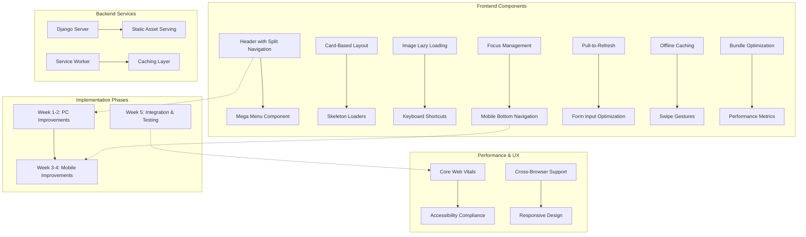

# Architecture Diagram for PC & Mobile Improvements

## Component Relationships

### PC Improvements
- **Header Split**: Separates primary navigation from utility functions
- **Mega Menu**: Expands dropdown functionality with rich content
- **Card Layout**: Organizes content in visually distinct containers
- **Skeleton Loaders**: Provides visual feedback during loading
- **Lazy Loading**: Defers image loading for performance
- **Keyboard Shortcuts**: Enhances power user experience
- **Focus Management**: Improves accessibility

### Mobile Improvements
- **Bottom Navigation**: Persistent navigation for thumb-friendly access
- **Pull-to-Refresh**: Intuitive content refresh gesture
- **Form Optimization**: Larger touch targets and optimized inputs
- **Offline Caching**: Enhanced Service Worker functionality
- **Swipe Gestures**: Intuitive navigation through swiping
- **Bundle Optimization**: Reduced initial payload size

## Success Metrics Integration
All improvements contribute to the defined success metrics:
- Page load time < 2s
- Mobile score > 90 on Lighthouse
- User engagement increase 20%
- Bounce rate decrease 15%