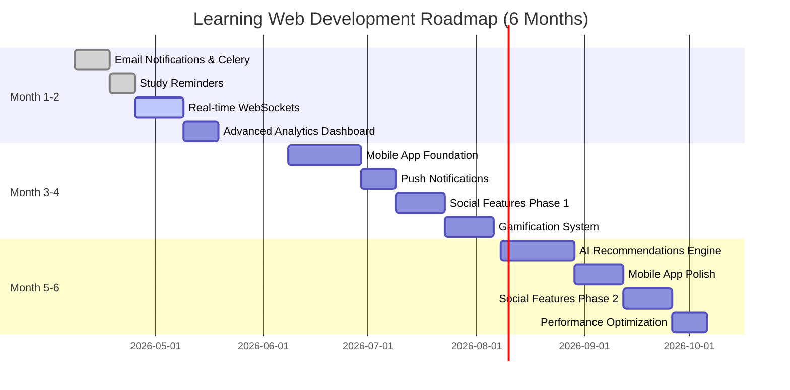
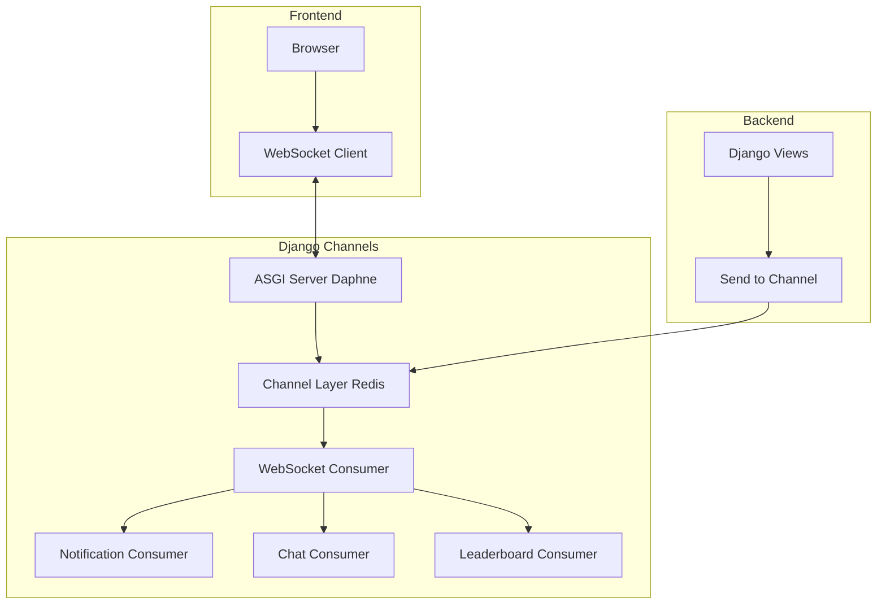
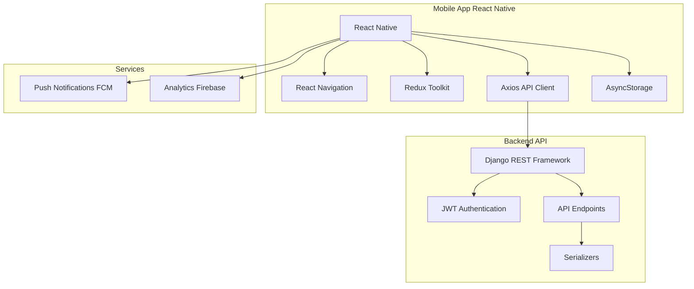
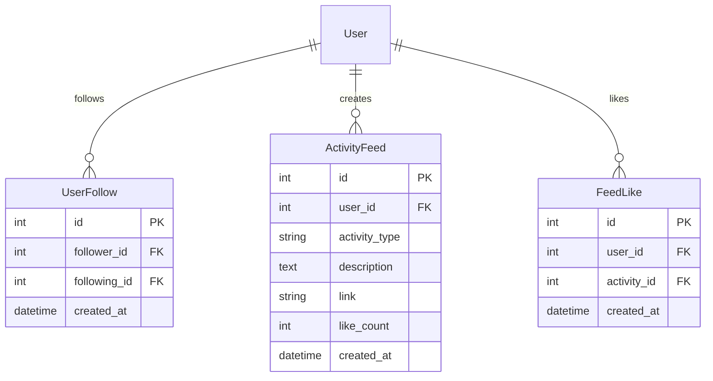
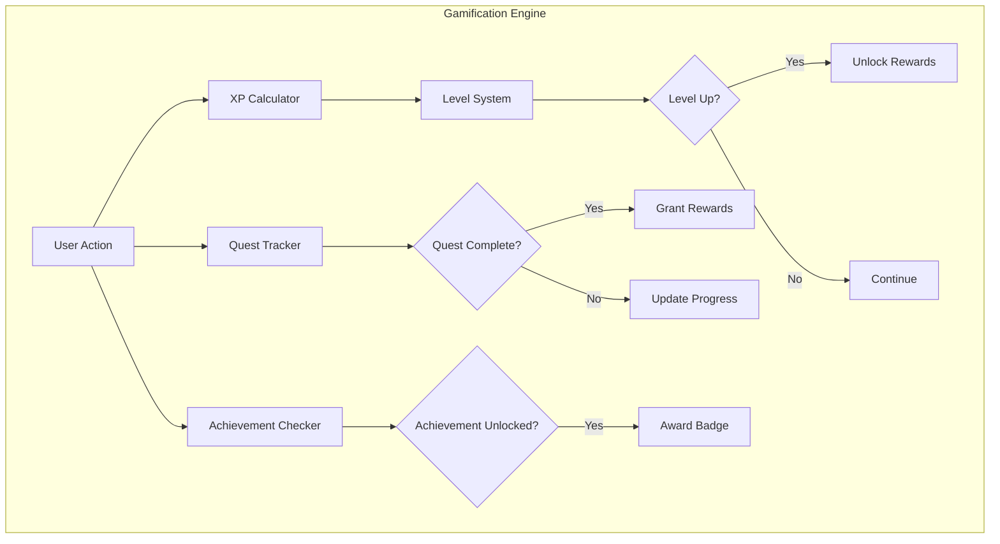
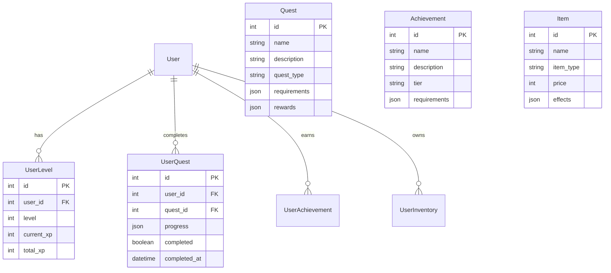
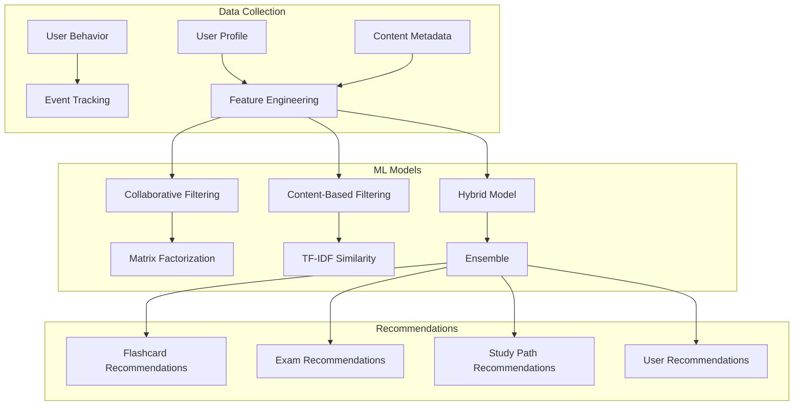
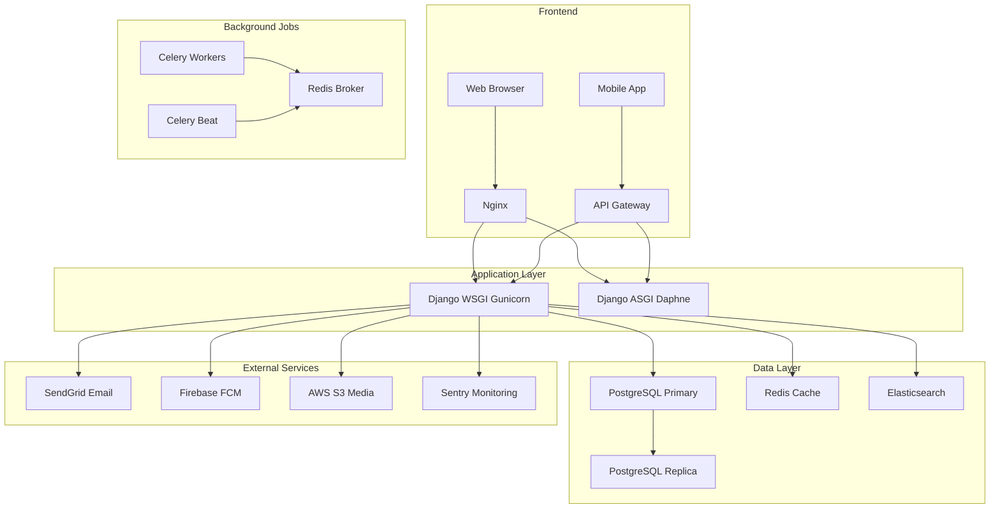

# 🚀 Kế Hoạch Dài Hạn 3-6 Tháng - Learning Web Platform

## 📋 Tổng Quan

**Timeline**: 3-6 tháng  
**Mục tiêu**: Chuyển đổi từ web app đơn giản thành nền tảng học tập toàn diện với mobile app, real-time features, và AI-powered recommendations

---

## 🎯 Vision & Goals

### Vision
Trở thành nền tảng học tập số 1 tại Việt Nam với:
- 📱 Mobile-first experience
- 🤖 AI-powered personalization
- 👥 Strong community features
- 🎮 Engaging gamification
- ⚡ Real-time collaboration

### Key Metrics (6 tháng)
- **Users**: 10,000+ active users
- **Retention**: 60%+ monthly retention
- **Engagement**: 30+ minutes/day average
- **Mobile**: 70%+ traffic from mobile
- **Community**: 5,000+ forum posts/month

---

## 📅 Timeline Overview



---

## 🗓️ MONTH 1-2: Foundation & Real-time Features

### Week 1-2: Email Notifications với Celery ✅
**Status**: Đã có kế hoạch chi tiết trong [`one-night-development-plan.md`](one-night-development-plan.md)

**Deliverables**:
- ✅ Celery + Redis setup
- ✅ 8 email templates
- ✅ Daily/Weekly digest
- ✅ Study reminders
- ✅ Email preferences

### Week 3-4: Real-time Updates với WebSockets

**Mục tiêu**: Thêm real-time notifications và live updates

#### Architecture



#### Implementation Tasks

**1. Setup Django Channels**
- [ ] Install Django Channels và Daphne
- [ ] Configure ASGI application
- [ ] Setup Redis channel layer
- [ ] Create routing configuration

**Files**:
- [`config/asgi.py`](../config/asgi.py) - ASGI config
- [`config/routing.py`](../config/routing.py) - WebSocket routing
- [`config/settings.py`](../config/settings.py) - Channels config

**2. Notification Consumer**
- [ ] Create WebSocket consumer cho notifications
- [ ] Handle connect/disconnect
- [ ] Send real-time notifications
- [ ] Mark as read via WebSocket

**Files**:
- [`apps/notifications/consumers.py`](../apps/notifications/consumers.py)
- [`apps/notifications/routing.py`](../apps/notifications/routing.py)

**3. Live Leaderboard**
- [ ] Real-time leaderboard updates
- [ ] Broadcast rank changes
- [ ] Show online users

**Files**:
- [`apps/leaderboard/consumers.py`](../apps/leaderboard/consumers.py)

**4. Frontend Integration**
- [ ] WebSocket client JavaScript
- [ ] Auto-reconnect logic
- [ ] Update UI on messages
- [ ] Toast notifications

**Files**:
- [`static/js/websocket.js`](../static/js/websocket.js)
- [`templates/base.html`](../templates/base.html) - Include WebSocket

### Week 5-6: Advanced Analytics Dashboard

**Mục tiêu**: Dashboard với charts và insights chi tiết

#### Features

**1. User Analytics Dashboard**
- [ ] Study time tracking
- [ ] Performance trends (Chart.js)
- [ ] Subject mastery radar chart
- [ ] Weekly/Monthly progress
- [ ] Streak calendar heatmap

**2. Admin Analytics**
- [ ] User growth metrics
- [ ] Engagement metrics
- [ ] Content performance
- [ ] Retention cohorts
- [ ] Revenue metrics (if applicable)

**3. Predictive Analytics**
- [ ] Predict exam scores
- [ ] Identify struggling students
- [ ] Recommend study time
- [ ] Churn prediction

#### Tech Stack
- **Frontend**: Chart.js, D3.js
- **Backend**: Pandas for data analysis
- **Caching**: Redis for computed metrics

**Files**:
- [`apps/analytics/`](../apps/analytics/) - New app
- [`apps/analytics/models.py`](../apps/analytics/models.py) - Analytics models
- [`apps/analytics/views.py`](../apps/analytics/views.py) - Dashboard views
- [`apps/analytics/utils.py`](../apps/analytics/utils.py) - Calculation logic
- [`templates/analytics/dashboard.html`](../templates/analytics/dashboard.html)

---

## 🗓️ MONTH 3-4: Mobile App & Social Features

### Week 7-9: Mobile App Foundation (React Native)

**Mục tiêu**: Cross-platform mobile app với core features

#### Architecture



#### Phase 1: Core Features

**1. Setup & Authentication**
- [ ] Initialize React Native project
- [ ] Setup navigation (React Navigation)
- [ ] Login/Register screens
- [ ] JWT token management
- [ ] Biometric authentication

**2. Main Features**
- [ ] Home dashboard
- [ ] Flashcard learning
- [ ] Exam taking
- [ ] Profile screen
- [ ] Notifications

**3. Offline Support**
- [ ] Cache flashcards locally
- [ ] Offline mode indicator
- [ ] Sync when online
- [ ] Queue actions

#### Tech Stack
- **Framework**: React Native (Expo)
- **State**: Redux Toolkit
- **API**: Axios + React Query
- **Storage**: AsyncStorage
- **UI**: React Native Paper

**Project Structure**:
```
mobile-app/
├── src/
│   ├── screens/
│   │   ├── Auth/
│   │   ├── Home/
│   │   ├── Flashcard/
│   │   ├── Exam/
│   │   └── Profile/
│   ├── components/
│   ├── navigation/
│   ├── redux/
│   ├── api/
│   ├── utils/
│   └── constants/
├── App.js
└── package.json
```

### Week 10: Push Notifications

**Mục tiêu**: Native push notifications cho mobile

#### Implementation

**1. Backend Setup**
- [ ] Install django-push-notifications
- [ ] Configure FCM (Firebase Cloud Messaging)
- [ ] Store device tokens
- [ ] Create push notification tasks

**Files**:
- [`apps/notifications/push.py`](../apps/notifications/push.py)
- [`apps/notifications/models.py`](../apps/notifications/models.py) - Add DeviceToken model

**2. Mobile Integration**
- [ ] Setup Firebase in React Native
- [ ] Request notification permissions
- [ ] Handle foreground notifications
- [ ] Handle background notifications
- [ ] Deep linking

### Week 11-12: Social Features Phase 1

**Mục tiêu**: Follow users và activity feed

#### Database Schema



#### Features

**1. User Following**
- [ ] Follow/Unfollow users
- [ ] Followers/Following lists
- [ ] Follow suggestions
- [ ] Mutual followers

**2. Activity Feed**
- [ ] Auto-generate activities
- [ ] Feed algorithm (chronological + relevance)
- [ ] Like activities
- [ ] Comment on activities
- [ ] Share activities

**3. User Discovery**
- [ ] Search users
- [ ] Suggested users (similar interests)
- [ ] Top contributors
- [ ] Nearby users (optional)

**Files**:
- [`apps/social/`](../apps/social/) - New app
- [`apps/social/models.py`](../apps/social/models.py)
- [`apps/social/views.py`](../apps/social/views.py)
- [`apps/social/signals.py`](../apps/social/signals.py) - Auto-create activities
- [`templates/social/feed.html`](../templates/social/feed.html)
- [`templates/social/profile.html`](../templates/social/profile.html)

---

## 🗓️ MONTH 5-6: AI & Advanced Features

### Week 13-15: Gamification System

**Mục tiêu**: XP, levels, quests, và rewards

#### System Design



#### Features

**1. XP & Levels**
- [ ] XP for all actions (study, exam, forum)
- [ ] Level progression (1-100)
- [ ] XP multipliers (streaks, events)
- [ ] Leaderboard by level

**2. Daily/Weekly Quests**
- [ ] Quest templates
- [ ] Auto-generate daily quests
- [ ] Progress tracking
- [ ] Rewards (XP, badges, items)

**3. Achievements**
- [ ] 50+ achievements
- [ ] Rare/Epic/Legendary tiers
- [ ] Hidden achievements
- [ ] Achievement showcase

**4. Rewards & Items**
- [ ] Virtual currency (coins)
- [ ] Profile customization items
- [ ] Power-ups (XP boost, hints)
- [ ] Exclusive content access

#### Database Schema



**Files**:
- [`apps/gamification/`](../apps/gamification/) - New app
- [`apps/gamification/models.py`](../apps/gamification/models.py)
- [`apps/gamification/xp.py`](../apps/gamification/xp.py) - XP calculation
- [`apps/gamification/quests.py`](../apps/gamification/quests.py) - Quest engine
- [`apps/gamification/achievements.py`](../apps/gamification/achievements.py)
- [`templates/gamification/dashboard.html`](../templates/gamification/dashboard.html)

### Week 16-18: AI-Powered Recommendations

**Mục tiêu**: Personalized content recommendations

#### AI Architecture



#### Features

**1. Content Recommendations**
- [ ] Recommend flashcard sets
- [ ] Recommend exams
- [ ] Recommend study topics
- [ ] Personalized difficulty

**2. User Recommendations**
- [ ] Find study buddies
- [ ] Suggest mentors
- [ ] Similar learners

**3. Study Path Optimization**
- [ ] Identify weak areas
- [ ] Suggest learning sequence
- [ ] Adaptive difficulty
- [ ] Time optimization

**4. Predictive Features**
- [ ] Predict exam performance
- [ ] Estimate study time needed
- [ ] Churn risk prediction
- [ ] Success probability

#### Tech Stack
- **ML Framework**: scikit-learn, TensorFlow Lite
- **Data Processing**: Pandas, NumPy
- **Storage**: PostgreSQL + Redis cache
- **Serving**: Django REST API

**Files**:
- [`apps/ml/`](../apps/ml/) - New app
- [`apps/ml/models.py`](../apps/ml/models.py) - ML model storage
- [`apps/ml/recommender.py`](../apps/ml/recommender.py) - Recommendation engine
- [`apps/ml/predictor.py`](../apps/ml/predictor.py) - Prediction models
- [`apps/ml/training.py`](../apps/ml/training.py) - Model training scripts
- [`apps/ml/tasks.py`](../apps/ml/tasks.py) - Celery tasks for training

### Week 19-20: Mobile App Polish

**Mục tiêu**: Hoàn thiện mobile app

#### Tasks

**1. UI/UX Improvements**
- [ ] Smooth animations
- [ ] Gesture controls
- [ ] Dark mode
- [ ] Accessibility

**2. Performance Optimization**
- [ ] Image optimization
- [ ] Lazy loading
- [ ] Code splitting
- [ ] Bundle size reduction

**3. Testing**
- [ ] Unit tests
- [ ] Integration tests
- [ ] E2E tests (Detox)
- [ ] Beta testing

**4. App Store Preparation**
- [ ] App icons & splash screens
- [ ] Screenshots
- [ ] App descriptions
- [ ] Privacy policy
- [ ] Terms of service

### Week 21-22: Social Features Phase 2

**Mục tiêu**: Study groups và collaboration

#### Features

**1. Study Groups**
- [ ] Create/join groups
- [ ] Group chat
- [ ] Share content in groups
- [ ] Group challenges
- [ ] Group leaderboard

**2. Collaborative Features**
- [ ] Co-create flashcard sets
- [ ] Shared study sessions
- [ ] Peer review
- [ ] Group study rooms (video)

**3. Mentorship Program**
- [ ] Match mentors with mentees
- [ ] Mentorship dashboard
- [ ] Progress tracking
- [ ] Feedback system

**Files**:
- [`apps/groups/`](../apps/groups/) - New app
- [`apps/groups/models.py`](../apps/groups/models.py)
- [`apps/groups/views.py`](../apps/groups/views.py)
- [`apps/groups/consumers.py`](../apps/groups/consumers.py) - Group chat WebSocket
- [`templates/groups/`](../templates/groups/)

### Week 23-24: Performance Optimization & Launch Prep

**Mục tiêu**: Optimize và chuẩn bị production

#### Tasks

**1. Database Optimization**
- [ ] Add indexes
- [ ] Optimize queries
- [ ] Database partitioning
- [ ] Connection pooling

**2. Caching Strategy**
- [ ] Redis caching
- [ ] CDN for static files
- [ ] API response caching
- [ ] Database query caching

**3. Security Hardening**
- [ ] Security audit
- [ ] Rate limiting
- [ ] DDoS protection
- [ ] Data encryption

**4. Monitoring & Logging**
- [ ] Setup Sentry
- [ ] Setup New Relic/DataDog
- [ ] Custom metrics
- [ ] Alert system

**5. Documentation**
- [ ] API documentation (Swagger)
- [ ] User guide
- [ ] Developer docs
- [ ] Deployment guide

---

## 🏗️ Technical Architecture Evolution

### Current State
```
Django Monolith
├── SQLite Database
├── Django Templates
├── Bootstrap CSS
└── Vanilla JavaScript
```

### Target State (6 months)
```
Microservices Architecture
├── Django Backend (API)
│   ├── PostgreSQL (Primary DB)
│   ├── Redis (Cache + Celery)
│   └── Elasticsearch (Search)
├── React Native Mobile App
├── Django Channels (WebSocket)
├── Celery Workers
│   ├── Email tasks
│   ├── ML training
│   └── Data processing
├── ML Service (Optional separate)
└── CDN (Static files)
```

### Infrastructure



---

## 📊 Success Metrics & KPIs

### Month 1-2 Targets
- [ ] Email open rate > 30%
- [ ] Daily active users +20%
- [ ] Average session time +15%
- [ ] Notification engagement > 40%

### Month 3-4 Targets
- [ ] Mobile app downloads > 1,000
- [ ] Mobile DAU > 500
- [ ] Social features adoption > 50%
- [ ] User-generated content +100%

### Month 5-6 Targets
- [ ] Total users > 10,000
- [ ] Monthly retention > 60%
- [ ] Mobile traffic > 70%
- [ ] AI recommendation CTR > 20%
- [ ] Revenue (if applicable) > $5,000/month

---

## 💰 Budget Estimation

### Infrastructure Costs (Monthly)

| Service | Cost | Notes |
|---------|------|-------|
| **Hosting** | $50-100 | DigitalOcean/AWS |
| **Database** | $25-50 | Managed PostgreSQL |
| **Redis** | $15-30 | Managed Redis |
| **CDN** | $10-20 | CloudFlare/AWS |
| **Email** | $10-30 | SendGrid |
| **Push Notifications** | $0-20 | Firebase (free tier) |
| **Monitoring** | $20-50 | Sentry + DataDog |
| **Storage** | $10-20 | AWS S3 |
| **Total** | **$140-320/month** | |

### Development Costs

| Phase | Hours | Cost (if outsourced) |
|-------|-------|---------------------|
| Month 1-2 | 160h | $8,000-16,000 |
| Month 3-4 | 200h | $10,000-20,000 |
| Month 5-6 | 180h | $9,000-18,000 |
| **Total** | **540h** | **$27,000-54,000** |

*Note: Costs vary based on developer rates ($50-100/hour)*

---

## 🎓 Team Requirements

### Ideal Team Composition

**Month 1-2** (2-3 people):
- 1x Backend Developer (Django, Celery)
- 1x Frontend Developer (JavaScript, WebSocket)
- 0.5x DevOps (part-time)

**Month 3-4** (3-4 people):
- 1x Backend Developer
- 1x Mobile Developer (React Native)
- 1x Frontend Developer
- 0.5x UI/UX Designer

**Month 5-6** (4-5 people):
- 1x Backend Developer
- 1x Mobile Developer
- 1x ML Engineer
- 1x Frontend Developer
- 0.5x QA Engineer

### Skills Required
- **Backend**: Django, DRF, Celery, WebSocket
- **Frontend**: React, JavaScript, WebSocket
- **Mobile**: React Native, Redux
- **ML**: Python, scikit-learn, TensorFlow
- **DevOps**: Docker, CI/CD, AWS/GCP
- **Database**: PostgreSQL, Redis, Elasticsearch

---

## ⚠️ Risks & Mitigation

### Technical Risks

| Risk | Impact | Probability | Mitigation |
|------|--------|-------------|------------|
| **Scalability issues** | High | Medium | Load testing, caching, CDN |
| **WebSocket stability** | Medium | Medium | Fallback to polling, monitoring |
| **ML model accuracy** | Medium | High | A/B testing, human review |
| **Mobile app bugs** | High | High | Beta testing, crash reporting |
| **Data loss** | Critical | Low | Backups, replication |

### Business Risks

| Risk | Impact | Probability | Mitigation |
|------|--------|-------------|------------|
| **Low user adoption** | High | Medium | Marketing, user feedback |
| **High churn rate** | High | Medium | Engagement features, support |
| **Competition** | Medium | High | Unique features, quality |
| **Budget overrun** | Medium | Medium | Phased approach, MVP first |

---

## 🚦 Go/No-Go Decision Points

### End of Month 2
**Criteria**:
- [ ] Email system working reliably
- [ ] WebSocket stable
- [ ] User engagement improved
- [ ] No critical bugs

**Decision**: Proceed to mobile development or pivot?

### End of Month 4
**Criteria**:
- [ ] Mobile app functional
- [ ] 1,000+ downloads
- [ ] Social features adopted
- [ ] Positive user feedback

**Decision**: Proceed to AI features or focus on growth?

### End of Month 6
**Criteria**:
- [ ] 10,000+ users
- [ ] 60%+ retention
- [ ] Revenue positive (if applicable)
- [ ] Technical debt manageable

**Decision**: Scale up or optimize?

---

## 📚 Learning Resources

### For Team Members

**Backend Development**:
- Django Channels documentation
- Celery best practices
- WebSocket protocols

**Mobile Development**:
- React Native documentation
- Redux Toolkit guide
- Mobile UI/UX patterns

**Machine Learning**:
- Recommendation systems course
- scikit-learn tutorials
- ML deployment best practices

**DevOps**:
- Docker & Kubernetes
- CI/CD pipelines
- Monitoring & logging

---

## 🎯 Next Steps

### Immediate Actions (This Week)
1. [ ] Review và approve roadmap
2. [ ] Assemble team
3. [ ] Setup project management (Jira/Trello)
4. [ ] Create detailed sprint plans
5. [ ] Setup development environment

### Month 1 Kickoff
1. [ ] Team onboarding
2. [ ] Architecture review
3. [ ] Sprint 1 planning
4. [ ] Setup CI/CD pipeline
5. [ ] Begin development

---

## 📞 Support & Communication

### Weekly Meetings
- **Monday**: Sprint planning
- **Wednesday**: Technical sync
- **Friday**: Demo & retrospective

### Communication Channels
- **Slack**: Daily communication
- **GitHub**: Code reviews
- **Jira**: Task tracking
- **Confluence**: Documentation

### Reporting
- **Daily**: Standup updates
- **Weekly**: Progress report
- **Monthly**: Executive summary

---

## ✅ Final Checklist

### Before Starting
- [ ] Roadmap approved by stakeholders
- [ ] Budget allocated
- [ ] Team assembled
- [ ] Tools & infrastructure ready
- [ ] Success metrics defined

### During Development
- [ ] Follow agile methodology
- [ ] Regular code reviews
- [ ] Continuous testing
- [ ] User feedback loops
- [ ] Documentation updates

### Before Launch
- [ ] Security audit passed
- [ ] Performance testing done
- [ ] Beta testing completed
- [ ] Documentation complete
- [ ] Marketing ready

---

**Total Timeline**: 6 months  
**Total Budget**: $27,000-54,000 (development) + $840-1,920 (infrastructure)  
**Team Size**: 2-5 people  
**Expected Outcome**: Production-ready platform with 10,000+ users

---

*Kế hoạch này là living document và sẽ được điều chỉnh dựa trên feedback và tiến độ thực tế. Hãy review và update thường xuyên!*
