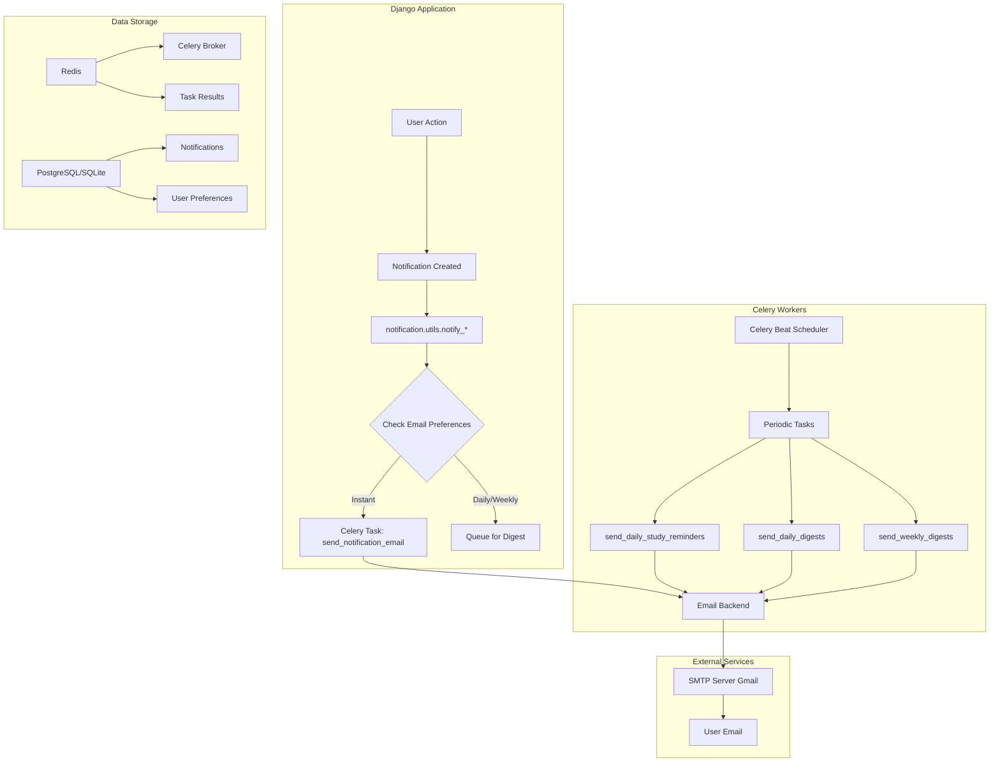
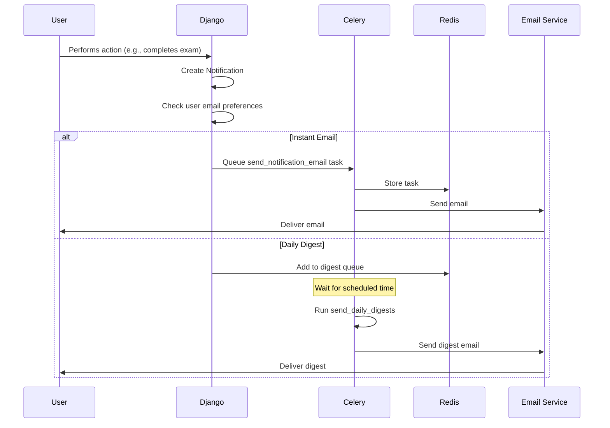
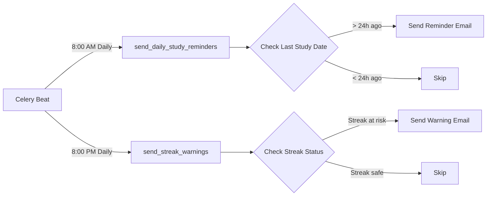

# 🌙 Kế Hoạch Phát Triển Một Đêm - Email Notifications & Study Reminders

## 📋 Tổng Quan

**Mục tiêu**: Phát triển hệ thống Email Notifications với Celery và Study Reminders trong 8-10 giờ  
**Ngày thực hiện**: Một đêm tập trung  
**Tác động**: Tăng user engagement và retention đáng kể

## 🎯 Tại Sao Chọn Tính Năng Này?

### Lý do chiến lược:
1. **High Impact**: Email notifications tăng retention rate 30-40%
2. **Feasible**: Có thể hoàn thành trong một đêm với kinh nghiệm Django
3. **Foundation**: Là nền tảng cho nhiều tính năng tương lai
4. **User Value**: Giúp users không bỏ lỡ thông báo quan trọng

### Tính năng đã có sẵn:
- ✅ Notification system đã hoàn chỉnh ([`apps/notifications/`](../apps/notifications/))
- ✅ Notification models và utils
- ✅ 8 loại thông báo đã được định nghĩa
- ✅ In-app notifications đang hoạt động

### Cần bổ sung:
- ❌ Email backend configuration
- ❌ Celery setup với Redis
- ❌ Email templates (HTML)
- ❌ Periodic tasks cho study reminders
- ❌ User email preferences
- ❌ Email digest (daily/weekly summary)

---

## ⏱️ Timeline Chi Tiết (8-10 giờ)

### Phase 1: Setup Infrastructure (2 giờ)

#### 1.1 Setup Redis & Celery (1 giờ)
- [ ] Cài đặt Redis trên Windows
- [ ] Cài đặt Celery và dependencies
- [ ] Cấu hình Celery trong Django project
- [ ] Test Celery worker connection

**Files cần tạo/sửa**:
- [`config/celery.py`](../config/celery.py) - Celery configuration
- [`config/__init__.py`](../config/__init__.py) - Import Celery app
- [`config/settings.py`](../config/settings.py) - Celery settings
- [`requirements.txt`](../requirements.txt) - Add celery, redis, celery-beat

#### 1.2 Setup Email Backend (1 giờ)
- [ ] Cấu hình email backend (Gmail SMTP hoặc Console)
- [ ] Test gửi email đơn giản
- [ ] Tạo base email template

**Files cần tạo/sửa**:
- [`config/settings.py`](../config/settings.py) - Email configuration
- [`templates/emails/base.html`](../templates/emails/base.html) - Base email template
- [`.env`](../.env) - Email credentials

---

### Phase 2: Email Notification System (3 giờ)

#### 2.1 Email Templates (1.5 giờ)
Tạo HTML email templates cho 8 loại thông báo:

**Templates cần tạo**:
- [`templates/emails/achievement.html`](../templates/emails/achievement.html) - Thành tựu mới
- [`templates/emails/leaderboard.html`](../templates/emails/leaderboard.html) - Xếp hạng
- [`templates/emails/exam_result.html`](../templates/emails/exam_result.html) - Kết quả thi
- [`templates/emails/forum_reply.html`](../templates/emails/forum_reply.html) - Trả lời forum
- [`templates/emails/flashcard_milestone.html`](../templates/emails/flashcard_milestone.html) - Cột mốc flashcard
- [`templates/emails/study_reminder.html`](../templates/emails/study_reminder.html) - Nhắc nhở học
- [`templates/emails/badge.html`](../templates/emails/badge.html) - Huy hiệu mới
- [`templates/emails/system.html`](../templates/emails/system.html) - Thông báo hệ thống

#### 2.2 Celery Tasks (1 giờ)
Tạo async tasks để gửi email:

**Files cần tạo**:
- [`apps/notifications/tasks.py`](../apps/notifications/tasks.py) - Celery tasks
  - `send_notification_email(notification_id)` - Gửi email cho 1 notification
  - `send_bulk_emails(user_ids, notification_type)` - Gửi hàng loạt
  - `send_daily_digest(user_id)` - Gửi tổng hợp hàng ngày
  - `send_weekly_digest(user_id)` - Gửi tổng hợp hàng tuần

#### 2.3 Update Notification Utils (0.5 giờ)
Tích hợp email vào notification system hiện có:

**Files cần sửa**:
- [`apps/notifications/utils.py`](../apps/notifications/utils.py)
  - Update các hàm `notify_*()` để trigger email tasks
  - Kiểm tra user preferences trước khi gửi

---

### Phase 3: Study Reminders (2 giờ)

#### 3.1 Study Streak Tracking (1 giờ)
Tạo model để track study streaks:

**Files cần tạo/sửa**:
- [`apps/nguoi_dung/models.py`](../apps/nguoi_dung/models.py)
  ```python
  class StudyStreak(models.Model):
      user = models.OneToOneField(User)
      current_streak = models.IntegerField(default=0)
      longest_streak = models.IntegerField(default=0)
      last_study_date = models.DateField(null=True)
  ```

- [`apps/nguoi_dung/utils.py`](../apps/nguoi_dung/utils.py)
  - `update_study_streak(user)` - Cập nhật streak khi user học
  - `check_streak_broken(user)` - Kiểm tra streak bị gián đoạn

#### 3.2 Periodic Reminder Tasks (1 giờ)
Tạo scheduled tasks với Celery Beat:

**Files cần tạo/sửa**:
- [`apps/notifications/tasks.py`](../apps/notifications/tasks.py)
  - `send_daily_study_reminders()` - Chạy mỗi ngày 8:00 AM
  - `send_streak_warnings()` - Nhắc nhở streak sắp mất
  - `check_inactive_users()` - Nhắc nhở users không hoạt động 3+ ngày

- [`config/settings.py`](../config/settings.py) - Celery Beat schedule
  ```python
  CELERY_BEAT_SCHEDULE = {
      'daily-study-reminders': {
          'task': 'apps.notifications.tasks.send_daily_study_reminders',
          'schedule': crontab(hour=8, minute=0),
      },
      'streak-warnings': {
          'task': 'apps.notifications.tasks.send_streak_warnings',
          'schedule': crontab(hour=20, minute=0),
      },
  }
  ```

---

### Phase 4: Email Preferences & Digest (2 giờ)

#### 4.1 Update Notification Preferences (1 giờ)
Mở rộng model preferences hiện có:

**Files cần sửa**:
- [`apps/notifications/models.py`](../apps/notifications/models.py)
  ```python
  class NotificationPreference(models.Model):
      # Existing fields...
      
      # Email preferences
      email_enabled = models.BooleanField(default=True)
      email_frequency = models.CharField(
          max_length=20,
          choices=[
              ('instant', 'Ngay lập tức'),
              ('daily', 'Tổng hợp hàng ngày'),
              ('weekly', 'Tổng hợp hàng tuần'),
              ('never', 'Không gửi email'),
          ],
          default='daily'
      )
      
      # Study reminders
      study_reminder_enabled = models.BooleanField(default=True)
      reminder_time = models.TimeField(default='08:00')
  ```

- [`apps/notifications/views.py`](../apps/notifications/views.py)
  - Update `preferences_view()` để handle email settings

- [`templates/notifications/preferences.html`](../templates/notifications/preferences.html)
  - Thêm email preferences UI

#### 4.2 Email Digest System (1 giờ)
Tạo hệ thống tổng hợp email:

**Files cần tạo**:
- [`templates/emails/daily_digest.html`](../templates/emails/daily_digest.html)
- [`templates/emails/weekly_digest.html`](../templates/emails/weekly_digest.html)

**Files cần sửa**:
- [`apps/notifications/tasks.py`](../apps/notifications/tasks.py)
  - `send_daily_digests()` - Gửi digest cho users chọn daily
  - `send_weekly_digests()` - Gửi digest cho users chọn weekly

---

### Phase 5: Testing & Polish (1-2 giờ)

#### 5.1 Testing (1 giờ)
- [ ] Test gửi email cho từng loại notification
- [ ] Test daily/weekly digest
- [ ] Test study reminders
- [ ] Test email preferences
- [ ] Test Celery tasks execution
- [ ] Test error handling

#### 5.2 Documentation (0.5 giờ)
- [ ] Update [`NOTIFICATION_SETUP.md`](../NOTIFICATION_SETUP.md)
- [ ] Tạo [`EMAIL_SETUP.md`](../EMAIL_SETUP.md)
- [ ] Update [`PROJECT_SUMMARY.md`](../PROJECT_SUMMARY.md)

#### 5.3 Polish & Bug Fixes (0.5 giờ)
- [ ] Fix any bugs found during testing
- [ ] Improve email templates styling
- [ ] Add unsubscribe links
- [ ] Add email footer with branding

---

## 🏗️ Kiến Trúc Kỹ Thuật

### System Architecture



### Email Flow



### Study Reminder Flow



---

## 📦 Dependencies Cần Cài Đặt

### Python Packages
```txt
celery==5.3.4
redis==5.0.1
celery-beat==2.5.0
django-celery-beat==2.5.0
django-celery-results==2.5.1
flower==2.0.1  # Optional: Celery monitoring
```

### System Requirements
- Redis Server (Windows: Redis-x64-*.msi)
- SMTP Server access (Gmail hoặc SendGrid)

---

## 🔧 Configuration Details

### 1. Celery Configuration ([`config/celery.py`](../config/celery.py))

```python
import os
from celery import Celery
from celery.schedules import crontab

os.environ.setdefault('DJANGO_SETTINGS_MODULE', 'config.settings')

app = Celery('learning_web')
app.config_from_object('django.conf:settings', namespace='CELERY')
app.autodiscover_tasks()

# Celery Beat Schedule
app.conf.beat_schedule = {
    'send-daily-study-reminders': {
        'task': 'apps.notifications.tasks.send_daily_study_reminders',
        'schedule': crontab(hour=8, minute=0),  # 8:00 AM
    },
    'send-streak-warnings': {
        'task': 'apps.notifications.tasks.send_streak_warnings',
        'schedule': crontab(hour=20, minute=0),  # 8:00 PM
    },
    'send-daily-digests': {
        'task': 'apps.notifications.tasks.send_daily_digests',
        'schedule': crontab(hour=18, minute=0),  # 6:00 PM
    },
    'send-weekly-digests': {
        'task': 'apps.notifications.tasks.send_weekly_digests',
        'schedule': crontab(day_of_week=1, hour=9, minute=0),  # Monday 9:00 AM
    },
}
```

### 2. Django Settings ([`config/settings.py`](../config/settings.py))

```python
# Celery Configuration
CELERY_BROKER_URL = 'redis://localhost:6379/0'
CELERY_RESULT_BACKEND = 'redis://localhost:6379/0'
CELERY_ACCEPT_CONTENT = ['json']
CELERY_TASK_SERIALIZER = 'json'
CELERY_RESULT_SERIALIZER = 'json'
CELERY_TIMEZONE = 'Asia/Saigon'
CELERY_BEAT_SCHEDULER = 'django_celery_beat.schedulers:DatabaseScheduler'

# Email Configuration
EMAIL_BACKEND = 'django.core.mail.backends.smtp.EmailBackend'
EMAIL_HOST = 'smtp.gmail.com'
EMAIL_PORT = 587
EMAIL_USE_TLS = True
EMAIL_HOST_USER = os.getenv('EMAIL_HOST_USER')
EMAIL_HOST_PASSWORD = os.getenv('EMAIL_HOST_PASSWORD')
DEFAULT_FROM_EMAIL = os.getenv('DEFAULT_FROM_EMAIL', 'noreply@learningweb.com')

# For development, use console backend
if DEBUG:
    EMAIL_BACKEND = 'django.core.mail.backends.console.EmailBackend'
```

### 3. Environment Variables ([`.env`](../.env))

```env
# Email Settings
EMAIL_HOST_USER=your-email@gmail.com
EMAIL_HOST_PASSWORD=your-app-password
DEFAULT_FROM_EMAIL=Learning Web <noreply@learningweb.com>

# Redis (if not localhost)
REDIS_URL=redis://localhost:6379/0
```

---

## 📧 Email Templates Structure

### Base Template ([`templates/emails/base.html`](../templates/emails/base.html))

```html
<!DOCTYPE html>
<html>
<head>
    <meta charset="UTF-8">
    <meta name="viewport" content="width=device-width, initial-scale=1.0">
    <style>
        body { font-family: Arial, sans-serif; line-height: 1.6; color: #333; }
        .container { max-width: 600px; margin: 0 auto; padding: 20px; }
        .header { background: #4CAF50; color: white; padding: 20px; text-align: center; }
        .content { background: #f9f9f9; padding: 20px; }
        .button { background: #4CAF50; color: white; padding: 10px 20px; text-decoration: none; border-radius: 5px; display: inline-block; }
        .footer { text-align: center; padding: 20px; font-size: 12px; color: #666; }
    </style>
</head>
<body>
    <div class="container">
        <div class="header">
            <h1>🎓 Learning Web</h1>
        </div>
        <div class="content">
            
        </div>
        <div class="footer">
            <p>Bạn nhận được email này vì đã đăng ký nhận thông báo từ Learning Web.</p>
            <p><a href="{{ unsubscribe_url }}">Hủy đăng ký</a> | <a href="{{ preferences_url }}">Cài đặt thông báo</a></p>
        </div>
    </div>
</body>
</html>
```

### Example: Achievement Email ([`templates/emails/achievement.html`](../templates/emails/achievement.html))

```html



<h2>🏆 Chúc mừng! Bạn đã đạt thành tựu mới!</h2>

<p>Xin chào {{ user.username }},</p>

<p>Bạn vừa đạt được thành tựu: <strong>{{ achievement_name }}</strong></p>

<p>{{ achievement_description }}</p>

<div style="text-align: center; margin: 30px 0;">
    <a href="{{ achievement_url }}" class="button">Xem Chi Tiết</a>
</div>

<p>Tiếp tục phát huy nhé! 💪</p>

```

---

## 🧪 Testing Strategy

### Manual Testing Checklist

#### Email Sending
- [ ] Test instant email notification
- [ ] Test daily digest email
- [ ] Test weekly digest email
- [ ] Test study reminder email
- [ ] Test streak warning email
- [ ] Test all 8 notification types

#### Celery Tasks
- [ ] Verify Celery worker is running
- [ ] Verify Celery beat is running
- [ ] Check task execution in Flower dashboard
- [ ] Verify tasks are queued correctly
- [ ] Test task retry on failure

#### User Preferences
- [ ] Test changing email frequency
- [ ] Test disabling email notifications
- [ ] Test changing reminder time
- [ ] Test unsubscribe link
- [ ] Verify preferences are respected

### Automated Tests

Create [`apps/notifications/tests_email.py`](../apps/notifications/tests_email.py):

```python
from django.test import TestCase
from django.core import mail
from apps.notifications.tasks import send_notification_email
from apps.notifications.models import Notification

class EmailNotificationTests(TestCase):
    def test_send_notification_email(self):
        # Create test notification
        notification = Notification.objects.create(...)
        
        # Send email
        send_notification_email(notification.id)
        
        # Check email was sent
        self.assertEqual(len(mail.outbox), 1)
        self.assertIn('subject', mail.outbox[0].subject)
```

---

## 🚀 Deployment Commands

### Development

```bash
# Terminal 1: Start Redis
redis-server

# Terminal 2: Start Django
python manage.py runserver

# Terminal 3: Start Celery Worker
celery -A config worker -l info --pool=solo

# Terminal 4: Start Celery Beat
celery -A config beat -l info --scheduler django_celery_beat.schedulers:DatabaseScheduler

# Optional Terminal 5: Start Flower (monitoring)
celery -A config flower
```

### Production

```bash
# Use supervisor or systemd to manage processes
# Example supervisor config in deployment docs
```

---

## 📊 Success Metrics

### Immediate (After 1 week)
- [ ] Email delivery rate > 95%
- [ ] Email open rate > 30%
- [ ] Click-through rate > 10%
- [ ] Unsubscribe rate < 2%

### Short-term (After 1 month)
- [ ] User retention improved by 20%
- [ ] Daily active users increased by 15%
- [ ] Study streak participation > 40%
- [ ] Email engagement rate > 25%

---

## 🔄 Future Enhancements

### Phase 2 (Next sprint)
1. **SMS Notifications** - Twilio integration
2. **Push Notifications** - Web Push API
3. **Notification Analytics** - Track open rates, CTR
4. **A/B Testing** - Test different email templates
5. **Personalization** - AI-powered content recommendations

### Phase 3 (Long-term)
1. **Multi-language Emails** - i18n support
2. **Rich Email Templates** - Interactive elements
3. **Email Campaigns** - Marketing automation
4. **Advanced Segmentation** - Target specific user groups

---

## ⚠️ Potential Issues & Solutions

### Issue 1: Gmail SMTP Limits
**Problem**: Gmail limits to 500 emails/day for free accounts  
**Solution**: 
- Use SendGrid (100 emails/day free)
- Use Mailgun (5000 emails/month free)
- Upgrade to Google Workspace

### Issue 2: Redis on Windows
**Problem**: Redis không có official Windows support  
**Solution**:
- Use WSL2 (Windows Subsystem for Linux)
- Use Redis Docker container
- Use Memurai (Redis-compatible for Windows)

### Issue 3: Celery Beat Duplicate Tasks
**Problem**: Multiple beat instances tạo duplicate tasks  
**Solution**:
- Chỉ chạy 1 beat instance
- Use django-celery-beat với database scheduler
- Add task deduplication logic

### Issue 4: Email Deliverability
**Problem**: Emails vào spam folder  
**Solution**:
- Setup SPF, DKIM, DMARC records
- Use reputable email service (SendGrid, Mailgun)
- Avoid spam trigger words
- Include unsubscribe link

---

## 📚 Resources & References

### Documentation
- [Celery Documentation](https://docs.celeryproject.org/)
- [Django Email Documentation](https://docs.djangoproject.com/en/4.2/topics/email/)
- [Redis Documentation](https://redis.io/documentation)
- [SendGrid API](https://docs.sendgrid.com/)

### Tutorials
- [Django + Celery Tutorial](https://realpython.com/asynchronous-tasks-with-django-and-celery/)
- [Email Templates Best Practices](https://www.campaignmonitor.com/resources/guides/email-design/)

---

## ✅ Final Checklist

### Before Starting
- [ ] Backup database
- [ ] Create new git branch
- [ ] Install all dependencies
- [ ] Setup Redis server
- [ ] Configure email credentials

### During Development
- [ ] Follow timeline strictly
- [ ] Test each component before moving on
- [ ] Commit code frequently
- [ ] Document any deviations from plan

### After Completion
- [ ] Run full test suite
- [ ] Update documentation
- [ ] Create pull request
- [ ] Deploy to staging
- [ ] Monitor for 24 hours
- [ ] Deploy to production

---

## 🎯 Expected Outcomes

Sau một đêm phát triển, bạn sẽ có:

1. ✅ **Email Notification System** hoàn chỉnh
   - 8 loại email templates đẹp mắt
   - Instant và digest email modes
   - User preferences đầy đủ

2. ✅ **Study Reminder System**
   - Daily study reminders
   - Streak tracking và warnings
   - Inactive user re-engagement

3. ✅ **Celery Infrastructure**
   - Async task processing
   - Scheduled periodic tasks
   - Monitoring với Flower

4. ✅ **Foundation for Future**
   - Scalable architecture
   - Easy to add new notification types
   - Ready for SMS/Push notifications

---

**Estimated Total Time**: 8-10 hours  
**Difficulty Level**: Intermediate  
**Prerequisites**: Django experience, basic Celery knowledge  
**Impact**: High - Significantly improves user engagement

---

*Kế hoạch này được thiết kế để thực hiện trong một đêm với focus và không bị gián đoạn. Hãy chuẩn bị coffee và snacks! ☕🍕*
