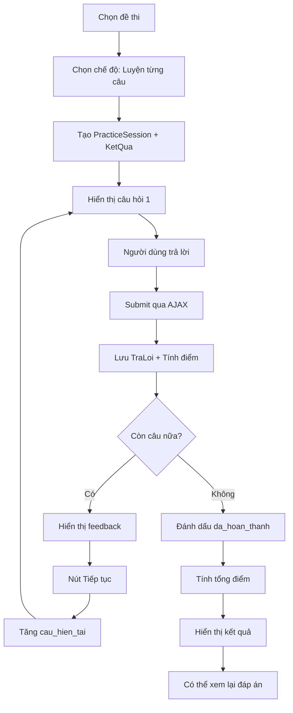

# Kế hoạch: Thêm chế độ luyện tập kiểu Wayground

## Tổng quan

Thêm chế độ luyện tập mới cho phép học sinh làm từng câu hỏi một và nhận phản hồi ngay lập tức (đúng/sai + giải thích) trước khi chuyển sang câu tiếp theo, tương tự như Wayground.

## Yêu cầu chức năng

### 1. Luồng hoạt động
- Người dùng chọn đề thi và chế độ "Luyện tập từng câu"
- Hiển thị từng câu hỏi một (không hiển thị tất cả câu cùng lúc)
- Sau khi trả lời, hiển thị ngay:
  - ✅/❌ Đúng hay sai
  - Đáp án đúng
  - Giải thích chi tiết (nếu có)
  - Điểm nhận được
- Nút "Tiếp tục" để chuyển sang câu tiếp theo
- Thanh tiến độ hiển thị số câu đã làm / tổng số câu
- Kết thúc: Hiển thị tổng kết điểm số và thống kê

### 2. Đặc điểm
- **Lưu lịch sử**: Có (giống chế độ luyện tập hiện tại)
- **Tính điểm**: Có
- **Leaderboard**: Không (is_official = False)
- **Xem lại**: Có thể xem lại toàn bộ bài làm sau khi hoàn thành
- **Không giới hạn thời gian**: Người dùng có thể suy nghĩ thoải mái

## Kiến trúc hệ thống

### 1. Database Schema

#### Model mới: PracticeSession
```python
class PracticeSession(models.Model):
    """Tracks question-by-question practice sessions"""
    nguoi_dung = models.ForeignKey(User, on_delete=models.CASCADE)
    de_thi = models.ForeignKey(DeThi, on_delete=models.CASCADE)
    ket_qua = models.OneToOneField(KetQua, on_delete=CASCADE, null=True, blank=True)
    
    # Session tracking
    cau_hien_tai = models.IntegerField(default=0)  # Index of current question (0-based)
    da_hoan_thanh = models.BooleanField(default=False)
    
    # Timestamps
    ngay_bat_dau = models.DateTimeField(auto_now_add=True)
    ngay_cap_nhat = models.DateTimeField(auto_now=True)
    
    class Meta:
        ordering = ['-ngay_bat_dau']
```

#### Sử dụng models hiện có
- **KetQua**: Lưu kết quả cuối cùng với `che_do='luyen_tung_cau'`
- **TraLoi**: Lưu từng câu trả lời ngay sau khi submit

### 2. URL Routes

```python
# apps/de_thi/urls.py
path('<int:de_id>/luyen-tung-cau/', views.bat_dau_luyen_tung_cau, name='bat_dau_luyen_tung_cau'),
path('luyen-tung-cau/<int:session_id>/', views.hien_thi_cau_hoi, name='hien_thi_cau_hoi'),
path('luyen-tung-cau/<int:session_id>/submit/', views.submit_cau_tra_loi, name='submit_cau_tra_loi'),
path('luyen-tung-cau/<int:session_id>/ket-qua/', views.ket_qua_luyen_tung_cau, name='ket_qua_luyen_tung_cau'),
```

### 3. Views Logic

#### View 1: [`bat_dau_luyen_tung_cau`](apps/de_thi/views.py:1)
```python
@login_required
def bat_dau_luyen_tung_cau(request, de_id):
    """Start a new practice session"""
    de = get_object_or_404(DeThi, id=de_id, an=False)
    
    # Create KetQua record
    ket_qua = KetQua.objects.create(
        nguoi_dung=request.user,
        de_thi=de,
        tong_cau=de.cau_hoi.count(),
        che_do='luyen_tung_cau',
        is_official=False
    )
    
    # Create PracticeSession
    session = PracticeSession.objects.create(
        nguoi_dung=request.user,
        de_thi=de,
        ket_qua=ket_qua,
        cau_hien_tai=0
    )
    
    return redirect('de_thi:hien_thi_cau_hoi', session_id=session.id)
```

#### View 2: [`hien_thi_cau_hoi`](apps/de_thi/views.py:1)
```python
@login_required
def hien_thi_cau_hoi(request, session_id):
    """Display current question in practice session"""
    session = get_object_or_404(PracticeSession, id=session_id, nguoi_dung=request.user)
    
    if session.da_hoan_thanh:
        return redirect('de_thi:ket_qua_luyen_tung_cau', session_id=session.id)
    
    cau_hoi_list = list(session.de_thi.cau_hoi.all().order_by('thu_tu', 'id'))
    
    if session.cau_hien_tai >= len(cau_hoi_list):
        # All questions answered, finalize
        session.da_hoan_thanh = True
        session.save()
        return redirect('de_thi:ket_qua_luyen_tung_cau', session_id=session.id)
    
    cau_hoi = cau_hoi_list[session.cau_hien_tai]
    
    # Prepare choices for TN questions
    if cau_hoi.loai == 'tn':
        cau_hoi.choices = [
            ('A', cau_hoi.dap_an_a),
            ('B', cau_hoi.dap_an_b),
            ('C', cau_hoi.dap_an_c),
            ('D', cau_hoi.dap_an_d)
        ]
    
    context = {
        'session': session,
        'cau_hoi': cau_hoi,
        'so_thu_tu': session.cau_hien_tai + 1,
        'tong_cau': len(cau_hoi_list),
        'tien_do': int((session.cau_hien_tai / len(cau_hoi_list)) * 100)
    }
    
    return render(request, 'de_thi/luyen_tung_cau.html', context)
```

#### View 3: [`submit_cau_tra_loi`](apps/de_thi/views.py:1) (AJAX)
```python
@login_required
@require_POST
def submit_cau_tra_loi(request, session_id):
    """Submit answer and return immediate feedback (AJAX)"""
    session = get_object_or_404(PracticeSession, id=session_id, nguoi_dung=request.user)
    
    cau_hoi_list = list(session.de_thi.cau_hoi.all().order_by('thu_tu', 'id'))
    cau_hoi = cau_hoi_list[session.cau_hien_tai]
    
    # Create TraLoi record
    tra_loi = TraLoi(ket_qua=session.ket_qua, cau_hoi=cau_hoi)
    dung = False
    diem = 0
    
    # Process answer based on question type
    if cau_hoi.loai == 'tn':
        chon = request.POST.get('chon', '').strip().upper()
        tra_loi.chon = chon
        dung = (chon == cau_hoi.dap_an_dung.strip().upper())
        diem = 1.0 if dung else 0.0
        dap_an_dung = cau_hoi.dap_an_dung
        
    elif cau_hoi.loai == 'dien':
        so_raw = request.POST.get('so_dien', '').strip()
        tra_loi.so_dien = so_raw
        try:
            dung = abs(float(so_raw) - float(cau_hoi.dap_an_so)) < 0.001
        except (ValueError, TypeError):
            dung = False
        diem = 1.0 if dung else 0.0
        dap_an_dung = cau_hoi.dap_an_so
        
    elif cau_hoi.loai == 'ds':
        chon_a = request.POST.get('chon_a') == 'true'
        chon_b = request.POST.get('chon_b') == 'true'
        chon_c = request.POST.get('chon_c') == 'true'
        chon_d = request.POST.get('chon_d') == 'true'
        
        tra_loi.chon_a = chon_a
        tra_loi.chon_b = chon_b
        tra_loi.chon_c = chon_c
        tra_loi.chon_d = chon_d
        
        so_dung = sum([
            chon_a == cau_hoi.dung_sai_a,
            chon_b == cau_hoi.dung_sai_b,
            chon_c == cau_hoi.dung_sai_c,
            chon_d == cau_hoi.dung_sai_d,
        ])
        
        diem_map = {0: 0.0, 1: 0.1, 2: 0.25, 3: 0.5, 4: 1.0}
        diem = diem_map.get(so_dung, 0.0)
        dung = (so_dung == 4)
        
        dap_an_dung = {
            'a': cau_hoi.dung_sai_a,
            'b': cau_hoi.dung_sai_b,
            'c': cau_hoi.dung_sai_c,
            'd': cau_hoi.dung_sai_d,
        }
    
    tra_loi.dung = dung
    tra_loi.diem_duoc = diem
    tra_loi.save()
    
    # Move to next question
    session.cau_hien_tai += 1
    session.save()
    
    # Check if this was the last question
    is_last = session.cau_hien_tai >= len(cau_hoi_list)
    
    if is_last:
        # Finalize session
        session.da_hoan_thanh = True
        session.save()
        
        # Calculate final score
        tong_diem = session.ket_qua.tra_loi.aggregate(Sum('diem_duoc'))['diem_duoc__sum'] or 0
        session.ket_qua.diem = (tong_diem / len(cau_hoi_list)) * 10
        session.ket_qua.save()
    
    # Return feedback
    return JsonResponse({
        'success': True,
        'dung': dung,
        'diem': diem,
        'dap_an_dung': dap_an_dung,
        'giai_thich': cau_hoi.giai_thich,
        'is_last': is_last,
        'next_url': reverse('de_thi:ket_qua_luyen_tung_cau', args=[session.id]) if is_last else None
    })
```

#### View 4: [`ket_qua_luyen_tung_cau`](apps/de_thi/views.py:1)
```python
@login_required
def ket_qua_luyen_tung_cau(request, session_id):
    """Display practice session results"""
    session = get_object_or_404(PracticeSession, id=session_id, nguoi_dung=request.user)
    
    if not session.da_hoan_thanh:
        return redirect('de_thi:hien_thi_cau_hoi', session_id=session.id)
    
    # Reuse existing ket_qua template
    return redirect('de_thi:ket_qua', kq_id=session.ket_qua.id)
```

### 4. Frontend Templates

#### Template: [`luyen_tung_cau.html`](templates/de_thi/luyen_tung_cau.html:1)

**Cấu trúc:**
- Header cố định với thanh tiến độ
- Card hiển thị câu hỏi hiện tại
- Form trả lời (tùy theo loại câu)
- Nút "Kiểm tra đáp án"
- Overlay feedback (ẩn ban đầu):
  - Icon ✅/❌
  - Thông báo đúng/sai
  - Đáp án đúng
  - Giải thích
  - Nút "Tiếp tục" hoặc "Xem kết quả"

**Tính năng:**
- Disable form sau khi submit
- Animation hiển thị feedback
- Highlight đáp án đúng/sai
- Progress bar cập nhật real-time

#### Template: Cập nhật [`chon_che_do.html`](templates/de_thi/chon_che_do.html:1)

Thêm option thứ 3:
```html
<div class="mode-card">
  <div class="icon">🎯</div>
  <h3>Luyện từng câu</h3>
  <p>Làm từng câu và biết ngay đáp án</p>
  <a href="" class="btn">Bắt đầu</a>
</div>
```

### 5. JavaScript Logic

```javascript
// Handle answer submission
document.getElementById('submit-answer').addEventListener('click', async () => {
  // Gather answer data
  const formData = new FormData();
  // ... collect answer based on question type
  
  // Disable form
  disableForm();
  
  // Submit via AJAX
  const response = await fetch(submitUrl, {
    method: 'POST',
    body: formData,
    headers: {
      'X-CSRFToken': csrfToken
    }
  });
  
  const data = await response.json();
  
  // Show feedback overlay
  showFeedback(data);
});

function showFeedback(data) {
  const overlay = document.getElementById('feedback-overlay');
  
  // Update content
  overlay.querySelector('.result-icon').textContent = data.dung ? '✅' : '❌';
  overlay.querySelector('.result-text').textContent = 
    data.dung ? 'Chính xác!' : 'Chưa đúng';
  overlay.querySelector('.correct-answer').textContent = 
    'Đáp án đúng: ' + data.dap_an_dung;
  overlay.querySelector('.explanation').textContent = data.giai_thich;
  
  // Update button
  const nextBtn = overlay.querySelector('.next-btn');
  if (data.is_last) {
    nextBtn.textContent = 'Xem kết quả';
    nextBtn.onclick = () => window.location.href = data.next_url;
  } else {
    nextBtn.textContent = 'Câu tiếp theo';
    nextBtn.onclick = () => window.location.reload();
  }
  
  // Show with animation
  overlay.classList.add('show');
}
```

## Sơ đồ luồng hoạt động



## Điểm khác biệt với chế độ hiện tại

| Tính năng | Luyện tập hiện tại | Luyện từng câu (mới) | Thi thật |
|-----------|-------------------|---------------------|----------|
| Hiển thị | Tất cả câu cùng lúc | Từng câu một | Tất cả câu cùng lúc |
| Feedback | Sau khi nộp bài | Ngay sau mỗi câu | Sau khi nộp bài |
| Thời gian | Không giới hạn | Không giới hạn | Có giới hạn |
| Xem đáp án | Sau khi nộp (nếu >6đ) | Ngay lập tức | Sau khi nộp (nếu >6đ) |
| Leaderboard | Không | Không | Có (nếu không vi phạm) |
| Lưu lịch sử | Có | Có | Có |

## Lợi ích

1. **Học tập hiệu quả hơn**: Feedback ngay lập tức giúp ghi nhớ tốt hơn
2. **Giảm áp lực**: Không phải lo lắng về tất cả câu cùng lúc
3. **Tập trung cao**: Chỉ focus vào một câu tại một thời điểm
4. **Linh hoạt**: Có thể dừng và quay lại sau (session được lưu)
5. **Phù hợp với mobile**: Giao diện đơn giản, dễ sử dụng trên điện thoại

## Các file cần tạo/sửa

### Tạo mới:
1. [`apps/de_thi/models.py`](apps/de_thi/models.py:1) - Thêm PracticeSession model
2. [`templates/de_thi/luyen_tung_cau.html`](templates/de_thi/luyen_tung_cau.html:1) - Template câu hỏi đơn
3. Migration file cho PracticeSession

### Chỉnh sửa:
1. [`apps/de_thi/views.py`](apps/de_thi/views.py:1) - Thêm 4 views mới
2. [`apps/de_thi/urls.py`](apps/de_thi/urls.py:1) - Thêm 4 URL patterns
3. [`templates/de_thi/chon_che_do.html`](templates/de_thi/chon_che_do.html:1) - Thêm option mới
4. [`apps/de_thi/admin.py`](apps/de_thi/admin.py:1) - Register PracticeSession (optional)

## Testing Checklist

- [ ] Tạo session mới thành công
- [ ] Hiển thị câu hỏi trắc nghiệm (tn) đúng
- [ ] Hiển thị câu hỏi đúng/sai (ds) đúng
- [ ] Hiển thị câu hỏi điền số (dien) đúng
- [ ] Submit câu trả lời qua AJAX thành công
- [ ] Feedback hiển thị đúng (đúng/sai, đáp án, giải thích)
- [ ] Chuyển câu tiếp theo hoạt động
- [ ] Thanh tiến độ cập nhật chính xác
- [ ] Câu cuối cùng chuyển đến trang kết quả
- [ ] Tính điểm chính xác
- [ ] Lưu vào lịch sử đúng
- [ ] Không tính vào leaderboard
- [ ] Có thể xem lại đáp án sau khi hoàn thành
- [ ] Responsive trên mobile

## Ghi chú kỹ thuật

1. **Session Management**: Sử dụng PracticeSession để track tiến độ, cho phép người dùng quay lại sau
2. **AJAX vs Page Reload**: Submit qua AJAX để feedback mượt mà, reload page khi chuyển câu để đơn giản
3. **Reuse Code**: Tận dụng logic chấm điểm từ view [`lam_bai`](apps/de_thi/views.py:148) hiện tại
4. **Database**: Minimal changes - chỉ thêm 1 model mới, reuse KetQua và TraLoi
5. **UX**: Animation và feedback rõ ràng để tạo trải nghiệm học tập tích cực

## Timeline ước tính

Không cung cấp ước tính thời gian theo yêu cầu.
