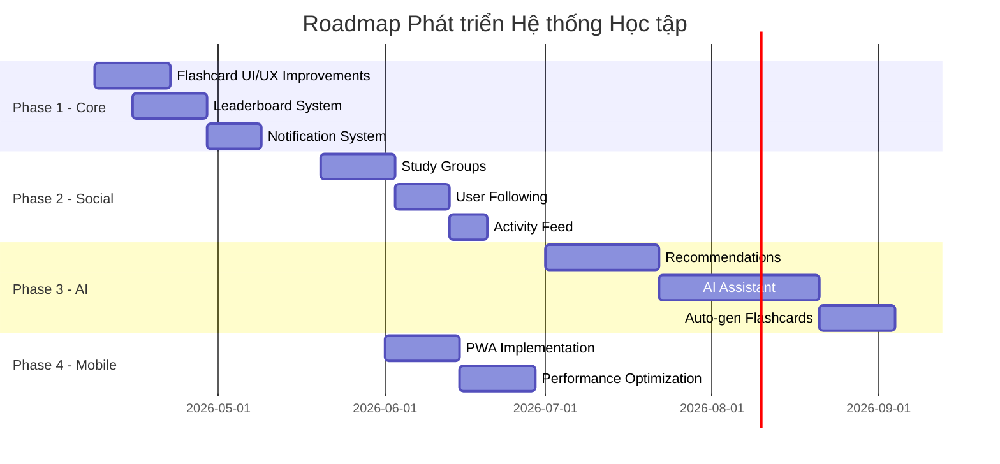
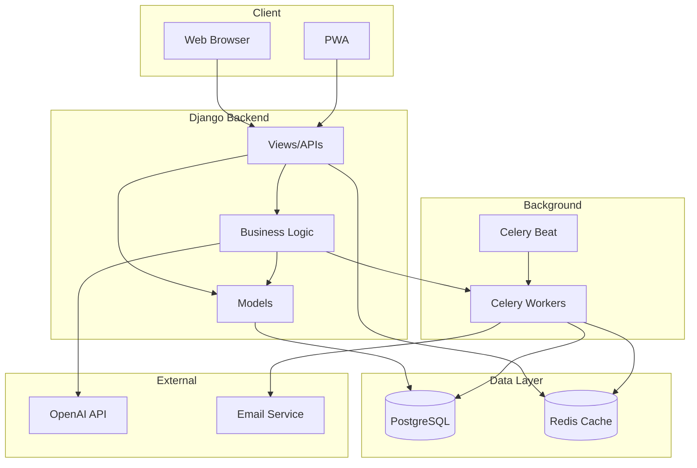
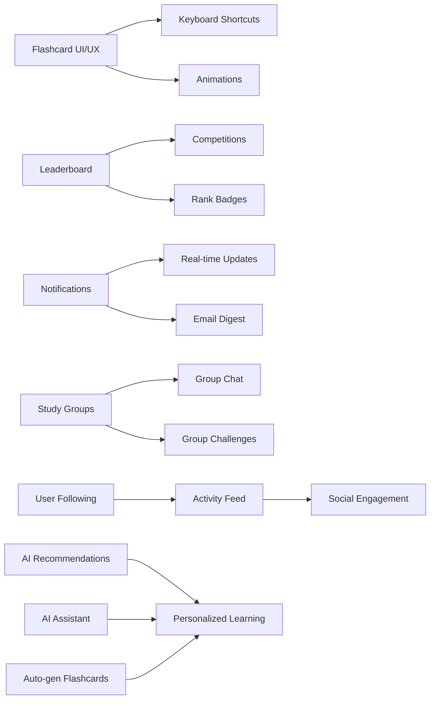
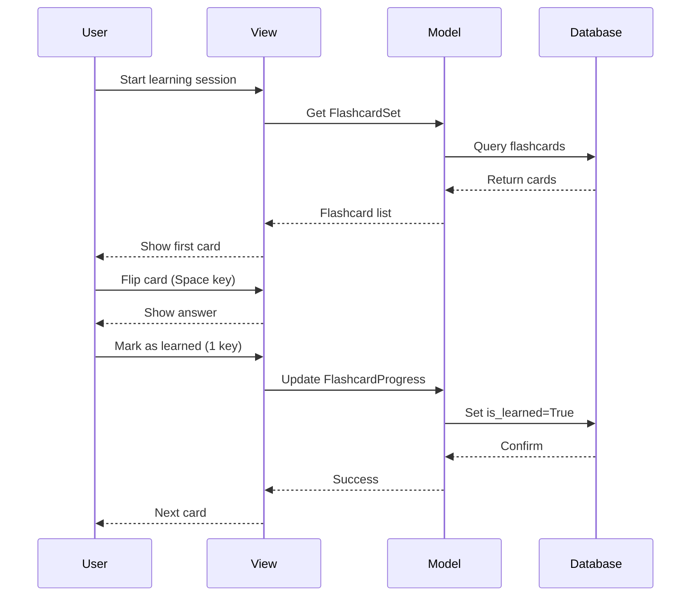
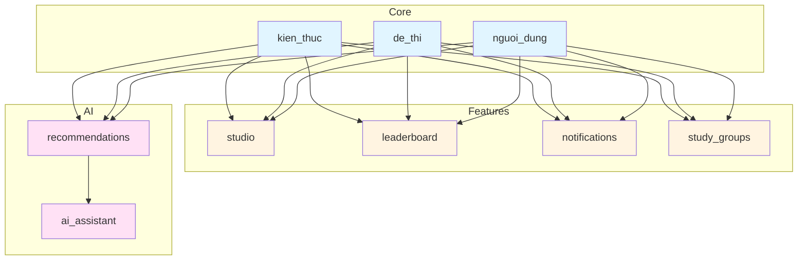
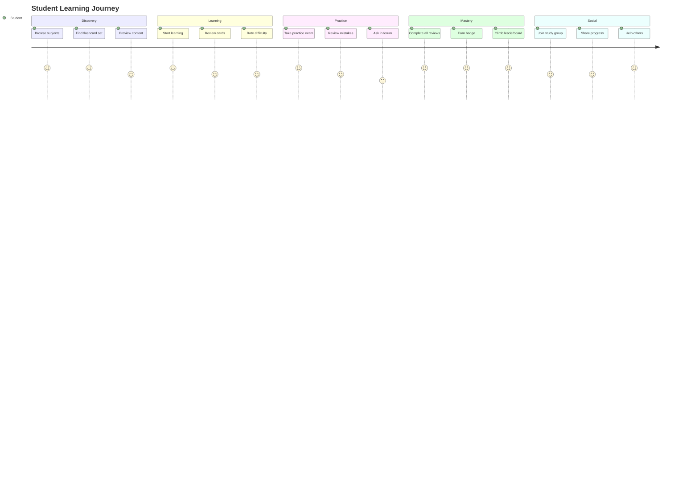
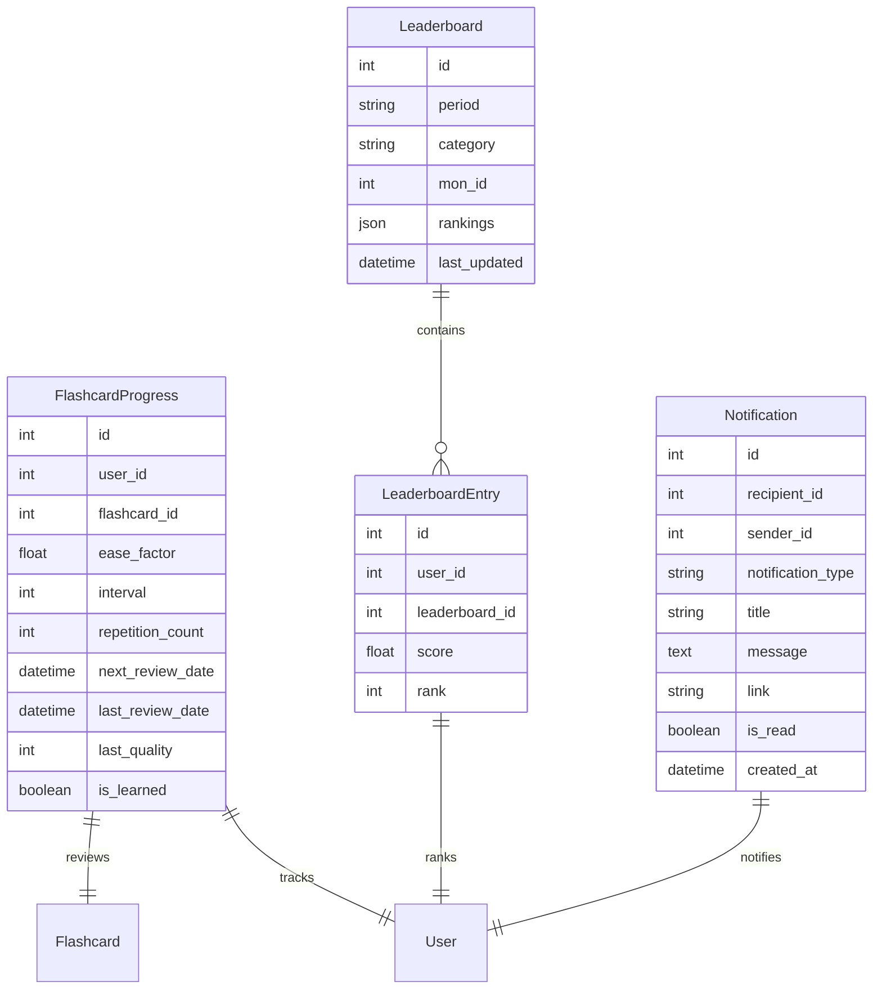
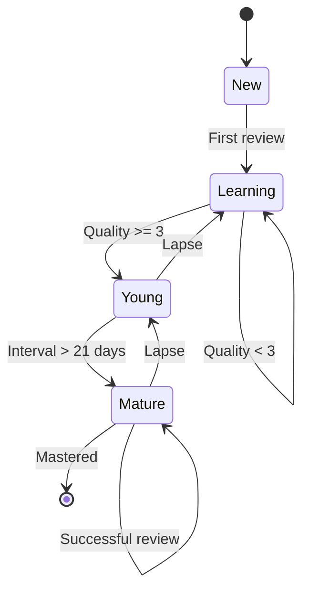
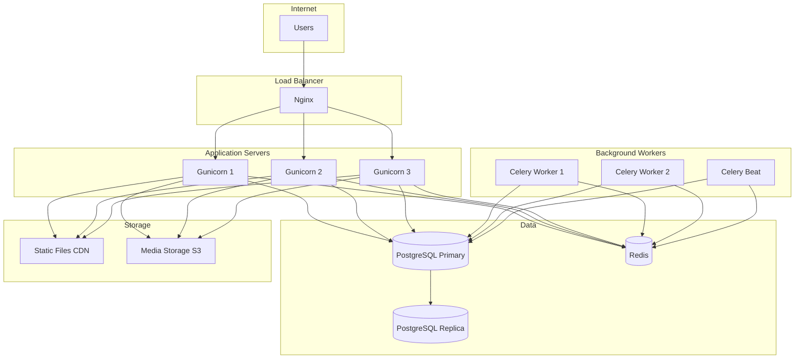
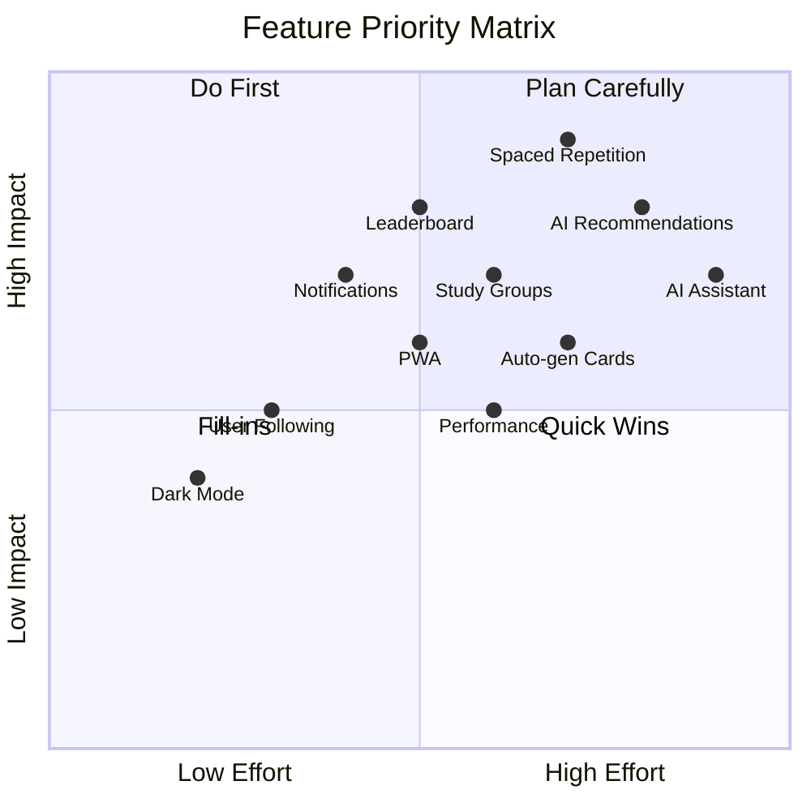

# Roadmap Visualization

## Timeline Overview

## System Architecture

## Feature Dependencies

## Data Flow - Flashcard Learning

## Module Relationships

## User Journey - Learning Flow

## Database Schema - Phase 1 Additions

## State Machine - Flashcard Learning

## Deployment Architecture

## Priority Matrix

---

*Các diagram này giúp visualize roadmap và kiến trúc hệ thống một cách trực quan.*
